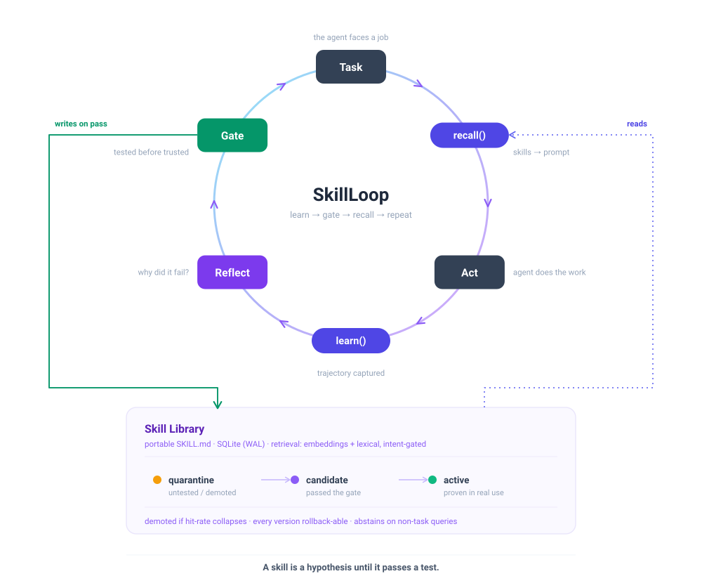
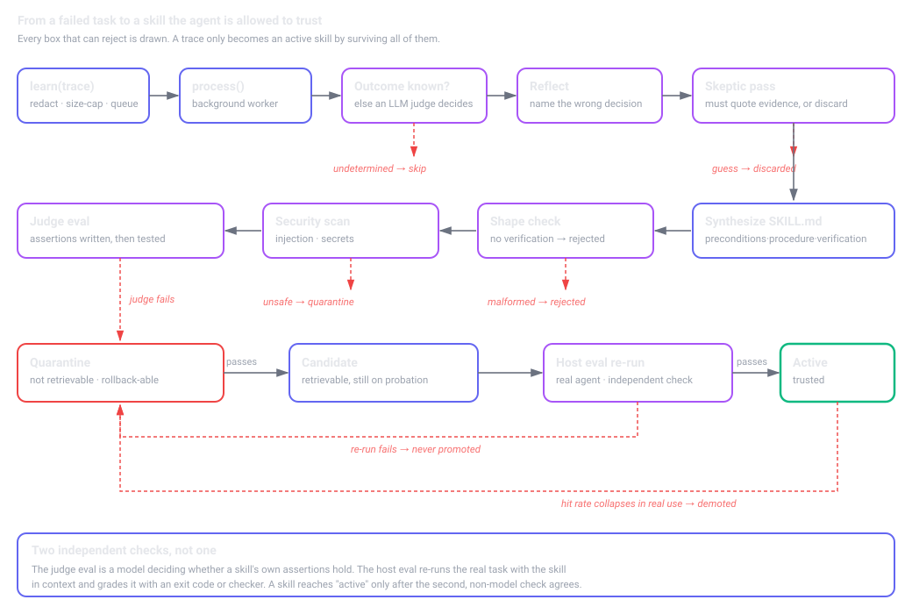

<div align="center">


<p align="center">
  
  
  
  <a href="CALIBRATION.md"></a>
</p>

<h3 align="center">Procedural memory for LLM agents — learn skills from failure, verify them before the agent trusts them.</h3>

<p align="center"><b>Your agent keeps making the same mistake every session. SkillLoop makes it stop.</b></p>

<p align="center">
  <a href="#why">Why</a> ·
  <a href="#architecture">Architecture</a> ·
  <a href="#how-it-works-step-by-step">How it works</a> ·
  <a href="#quickstart">Quickstart</a> ·
  <a href="#status--honest-scope">Evidence</a> ·
  <a href="CALIBRATION.md">Calibration</a>
</p>

</div>

---

## Why

LLM agents have amnesia. Every session starts from zero. An agent that failed a task yesterday, figured out the fix, and succeeded — makes the **same mistake tomorrow**. On its 100th task it's no better than its 1st.

**SkillLoop is a test-gated procedural-memory layer for LLM agents.** Most agent-memory tools (Mem0, Letta, Zep) store *semantic memory* — facts about the user — or *episodic memory* — raw chat history. SkillLoop stores **procedural memory**: *how to do the work*, learned from failures and **verified by a test before the agent is ever allowed to trust it**. It works with any agent framework and any model provider (OpenAI, Anthropic, Groq, Ollama, and more).

## Architecture

<div align="center">

</div>

Everything is two calls to your agent — **`recall(task)`** before a task, **`learn(trace)`** after. The rest runs in the background: a failure becomes a root cause, a root cause becomes a `SKILL.md`, and that skill is **gated by a test** before it can ever be retrieved. Skills that stop helping are demoted. Nothing is trusted until it passes.

## How it works, step by step

Follow the loop in the diagram above. Here is exactly what happens on each pass:

**1 · Task.** Your agent is about to do something — fix a test, edit a config, deploy a service.

**2 · `recall(task)`.** *Before* the agent acts, SkillLoop looks in its library for skills relevant to this task and returns them as text you drop into the prompt. This is **hybrid retrieval**: embeddings find semantically-related skills even when the wording differs, a lexical layer adds precision, an **intent gate** refuses to fire on non-tasks ("write a poem", "what is X"), and if nothing is genuinely relevant it **abstains** and returns nothing. Fast, local, no LLM call.

**3 · Act.** The agent does the task, now primed with any hard-won lessons from past failures.

**4 · `learn(trace)`.** *After* the task, you hand SkillLoop the trajectory — the commands run, what came back, and whether it worked (a test result, an exit code, a checker). This is fire-and-forget; the agent moves on. Secrets are redacted and the trace is size-capped before anything is stored.

**5 · Reflect.** In the background, if the task *failed*, a model examines the trajectory and names the **decision** that went wrong — not the error message, the decision. A second *skeptic* pass must quote the evidence for that root cause, or the lesson is thrown away as a guess.

**6 · Synthesize.** The lesson becomes a `SKILL.md` in a fixed shape: **preconditions · procedure · verification · failure modes · scope**. The *verification* section is mandatory — a skill that can't say how to prove it worked is rejected.

**7 · Gate.** The new skill is treated as a hypothesis. It's scanned for injected/malicious content, then **tested**: does an agent following it actually satisfy the assertions? Only if it passes does it enter the library as a **candidate**. If not, it's quarantined.

**8 · Into the Skill Library — and back around.** A candidate that proves itself in real use is promoted to **active**. One that starts failing is **demoted** back to quarantine. Every version is rollback-able. Next time a similar task comes up, `recall` surfaces the skill — and the loop tightens.

> **A skill is a hypothesis until it passes a test.**

### The same loop, with every rejection drawn

The diagram above is the happy path. This is what actually happens to a trace — including the six places it
can be thrown away, and the two *independent* checks a skill must clear before the agent is allowed to
trust it:

<div align="center">

</div>

The distinction that matters for evaluating this project: the **judge eval** is a model checking a skill's own
assertions, but the **host eval** re-runs the real task with the skill in context and grades it with an exit
code or a checker. A skill reaches `active` only when that second, non-model check agrees. A skill whose hit
rate later collapses in real use is demoted back to quarantine.

## Quickstart

```bash
# not on PyPI yet - install from source:
pip install "skillloop[openai] @ git+https://github.com/siddhartth04/SkillLoop"
# or clone and: pip install -e ".[openai]"     # [anthropic] also available; core is stdlib-only
```

```python
from skillloop import SkillLoop

loop = SkillLoop()

with loop.session("migrate the postgres schema") as s:
    prompt += s.skills_text()               # step 2: inject what past failures taught
    ...                                      # step 3: your agent does its work
    s.tool("bash", {"cmd": cmd}, result=out, error=err)
    s.verified_by(check.returncode)          # step 4: an independent check — not the agent's opinion
```

That's the whole integration. The `session` records the trajectory and submits it on exit — including an uncaught exception, which is often the most valuable trace of all. Already have trajectories in OpenAI/Anthropic format? `loop.learn({"task": ..., "format": "openai", "messages": [...]})` takes them directly.

### The lesson arrives when the mistake does

Mistakes rarely show up in the task description; they show up mid-task, as an error. When a recorded tool call fails, the session matches the error against every skill's recorded symptoms and queues the relevant ones for the agent's next step:

```python
    s.tool("python", {"code": code}, error=stderr)   # a failed call
    prompt += s.hints_text()                          # the matching lesson, before the next step ('' if none)
```

Or push them straight into your agent with `loop.session(task, on_hint=callback)`. Outside a session: `loop.recall_for_error(error_text, task=...)`.

### Keep the loop running

`learn()` only queues. Skills are written by `loop.process()`: call it after tasks, or use `SkillLoop(auto_process=True)` / `SKILLLOOP_AUTO_PROCESS=1` for a background worker. SkillLoop warns once if traces pile up with nothing processing them.

A new skill is a *candidate* until the agent re-runs the task that produced it, with the skill in context, and passes an independent check. Automate that re-run:

```python
def runner(task, skill_md):                 # your agent, with skill_md in its prompt
    s = loop.session(task, auto_learn=False)
    ...                                      # run it
    return s.verified_by(check.returncode)   # a real check, not the agent's opinion

loop.run_pending_evals(runner)               # passes -> active; fails or crashes -> not promoted
```

## Status & honest scope

This project's defining trait is that **it does not overclaim.**

> **Check every number yourself:** `python qa/reproduce.py` re-runs each claim below that does not need an
> API key and verifies it against the figure published here — 9/9 in about two minutes. Results that needed a
> model are replayed from committed raw data and labelled as such. If a claim ever stops reproducing, the
> script exits non-zero.

### 🟡 Promising pilot — pre-registered, honest about power

On **3 necessity-screened tasks** (each run 3×), where a baseline agent reliably fails, attaching learned skills flipped every task to success — replicated in direction across two model families. Statistics were fixed before results were seen.

| Agent | Tasks (control → treat) | Task-level sign test |
|:--|:--:|:--:|
| gpt-oss-20b | 3/3 tasks flipped fail → pass | p = 0.25 *(underpowered)* |
| qwen3.8-27b | 3/3 tasks flipped fail → pass | p = 0.25 *(underpowered)* |

**Read this honestly.** The independent unit is the *task*, and there are only three. Three tasks cannot reach p < 0.05 even with a perfect split — the sign test bottoms out at p = 0.25. So this is a **promising 3-task pilot with a clean directional signal**, *not* a significant result yet. (A per-trial test gives p = 0.0078, but repeated runs of the same task aren't independent, so that number is anti-conservative and we don't report it.) Reproduce and see for yourself: `python qa/report_ab.py evidence/ab.json`.

**To earn a real claim, the project needs more distinct tasks** — the HumanEval+ run (in progress) is the path there.

### 🧪 Head-to-head against a real baseline — including where it loses

The pilot above shows skills beat *no memory*. The harder question is whether SkillLoop's machinery beats
**simply pasting past attempts into the prompt**. A second evaluation asks exactly that, on a library that
exists nowhere in pretraining: a seeded generator builds an API whose names, data and conventions all come
from a random seed, so the model cannot know it and cannot have memorized it.

Protocol ([`qa/conv_eval/PROTOCOL.md`](qa/conv_eval/PROTOCOL.md)) was **fixed before any model ran** — gates,
metrics, statistical test and the exact verdict wording. Model: `openai/gpt-oss-120b`, temperature 0.

| Condition | Solved (2 attempts) | vs control (paired) |
|:--|:--:|:--:|
| Control (docs only) | 3/18 = 17% | — |
| Control, repeated *(null check)* | 5/18 = 28% | — |
| Simple memory *(raw past attempts)* | 10/18 = 56% | 7–0, p = 0.016 |
| **SkillLoop** | **11/18 = 61%** | **8–0, p = 0.008** |
| Oracle *(perfect notes)* | 18/18 = 100% | — |

**SkillLoop beats control (p = 0.008). It does *not* beat simple memory (4–3, p = 1.0).**

That is the pre-registered verdict, reported as written: *"SkillLoop helps, but its extra machinery is not yet
justified over simple memory."* Three of four seeds were **excluded by their own gates** before SkillLoop ran
on them, leaving n = 18 — one seed. This is a single-seed result, not a settled one.

**Why it came out that way** matters more than the score. Splitting the same 18 tasks by what the *training
feedback* revealed separates them cleanly:

| Training feedback | n | control | memory | SkillLoop |
|:--|:--:|:--:|:--:|:--:|
| A traceback naming the problem | 9 | 3/9 | **9/9** | 6/9 |
| Only "check failed" | 9 | 0/9 | 1/9 | **5/9** |

When a training attempt crashed, the fix is sitting in the recorded code and raw past attempts are very hard
to beat. When it merely failed its check, the learner was told "check failed" and nothing else — **the correct
value was never shown to it**, every recorded attempt is wrong, and copying them cannot help. That is the case
a learned skill exists for, and there it wins 4–0 head-to-head (p = 0.125, n = 9 — directional, not
significant). Reproduce with `python -m qa.conv_eval.analyze`.

The clearest pair, from the same run: the *units* skill could not know timeouts were milliseconds, so it wrote
a procedure to **find out** — probe the API, measure, convert — and scored 3/3 where memory scored 0/3. The
*config-keys* skill could not know the keys were `UPPER-KEBAB-CASE`, and **guessed** `'retries'`; the real key
was `'MAX-RETRIES'`, and it scored 0/3 — although the documented `read_config()` would have answered it in one
call. Encoding a way to discover the unknown generalises; asserting it is a coin flip. The synthesis prompt now
carries a rule for exactly that, **untested against a real model** until the next seed runs.

Two things make it worth reading anyway. The methods succeed on **different conventions** (SkillLoop 3/3 on
unit errors where memory scored 0/3; memory 3/3 on return-shape errors where SkillLoop scored 1/3), which
points at combining them rather than choosing. And 7 of SkillLoop's 11 wins came on the **second** attempt —
error-time recall, not task-start recall, is doing the work.

One caveat that run exposed, and which is now fixed: the eval stopped at `process()`, so all seven learned
skills stayed `candidate` and the verification gate — the project's central claim — was never exercised. The
agent was consuming skills that had passed only a model's judgement. Both runners now re-run each new skill's
own task, graded by the hidden checker, before it can reach `active`; and a skill that is still a candidate
now says so in the agent's prompt rather than reading like established fact.

Everything is in [`qa/conv_eval/RESULTS.md`](qa/conv_eval/RESULTS.md): every episode, every learned skill, and
the failures. Validate the harness without a model or an API key:

```bash
python -m qa.conv_eval.run --selfcheck      # generator, checkers, gates, stats — all offline
```

### ⚠️ Caveats that travel with those numbers

- **Selection effect by design** — measured only where the baseline fails ≥60%. Shows a skill *can* help, not how often one applies.
- **The margin shrinks as agents get stronger** (11% → 33% control). Report per-model, never pooled.
- **Single domain** — shell/text. A HumanEval+ coding evaluation is *built and in progress*, not yet measured. **No cross-domain claim is made.**
- **Retrieval on paraphrase is a known frontier** — lexical-only scored F1 0.47 on a blind adversarial probe set; the hybrid embedding path (below) is the fix, and needs an embedding model configured to reach its ceiling.

### 🔬 What we're proudest of

SkillLoop **caught its own false positives six times** during development — impossible task checkers, a hallucinating agent model, a GIL-masked concurrency test, rate-limit errors miscounted as failures, a wrong-interpreter checker, and a text encoding that silently destroyed five of six learned skills and very nearly published a clean, plausible result *against* the project's own central claim. Each would have manufactured a fake result. All documented in [`CALIBRATION.md`](CALIBRATION.md), including the experiments that *failed*. The rigor is the point.

### 🎯 Retrieval: does the lesson come back when it matters?

Deterministic, no API key, reproducible with `python qa/run_r1.py` and `python qa/run_r2.py`.

| Probe class | n | before | now |
|---|---|---|---|
| **R1** A. direct phrasing | 14 | 13 | **14** |
| **R1** B. paraphrase, no shared words | 14 | 7 | 7 |
| **R1** C. sibling skills | 14 | 14 | 14 |
| **R1** D. lexical traps (must abstain) | 14 | 8 | **14** |
| **R1** E. unrelated (must abstain) | 14 | 14 | 14 |
| **R2** Q. real tasks phrased as questions | 14 | 2 | **14** |
| **R2** S. raw error output, mid-task | 14 | 12 | **14** |
| **R2** T. knowledge / creation traps (must abstain) | 14 | 8 | **14** |

Stable from 0 to 2,000 distractor skills. Caveats: **R2 was written before the changes, but by the author of the fixes and against the same library**; treat it as a stress test, not independent confirmation. One R2 trap ("how does pip resolve…") was fixed after it was seen. **R1-B is unsolved lexically**: those probes share no words with their skill, which only embeddings can match. The embedding path now accepts strong matches without word overlap (`SKILLLOOP_EMBED_STRONG`, default 0.62); that is unit-tested but **not yet measured with a real embedding model**. `tests/test_purpose.py` runs the whole loop (fail, learn, rephrase, error mid-task, re-run, promote) against a simulated agent.

## Use it with any agent

| Path | How | For |
|:--|:--|:--|
| **Python** | `with loop.session(task) as s:` | embedding an agent in Python |
| **MCP** | `skillloop mcp` | Claude Code, Cursor, any MCP host *(protocol-verified)* |
| **HTTP** | `skillloop http` → `POST /recall`, `/learn` | any language, any stack |
| **Docker** | `docker run -p 7331:7331 -v data:/data skillloop` | production — health, backups, graceful shutdown |

Works with **any** provider: Anthropic and OpenAI natively, plus anything OpenAI-compatible via `OPENAI_BASE_URL` — Groq, OpenRouter, **Ollama (fully local, zero data leaves your machine)**, vLLM. Set `SKILLLOOP_EMBED_MODEL` to turn on hybrid retrieval. A `manual` provider runs the learning pipeline with no API key at all. Skills export as [agentskills.io](https://agentskills.io) `SKILL.md`.

## When it helps

Best when your agent **(a)** does repeatable tasks, **(b)** can tell if it succeeded — a test, exit code, checker — and **(c)** keeps failing the same things. Its sweet spot is *project-specific* knowledge no model has from pretraining: this repo's quirks, this build's silent failure, this API's odd error. It does **not** make the model smarter at novel problems, and it needs a success signal to learn from.

## Under the hood

- **Retrieval** — hybrid: embeddings surface candidates independently of wording, lexical + anchor rules add precision, an intent gate blocks non-task queries, and abstention is a real answer. Held-out (author probes): precision 1.0, 0 false-fires; scales to 200+ skills at single-digit ms.
- **Skills are playbooks** — itemized bullets with helpful/harmful counters; patches are deterministic *delta ops*, never a full rewrite (avoids context-collapse — [ACE, ICLR 2026](https://arxiv.org/abs/2510.04618)).
- **Security** — secret redaction, size caps, injection scanning + LLM judge, quarantine-by-default. `pytest tests/test_redteam.py` (20 cases).
- **Production** — thread-safe SQLite (per-thread connections, WAL), structured JSON logs with request IDs, `/health`, graceful shutdown, migrations, online backup. See [`DEPLOYMENT.md`](DEPLOYMENT.md).

## Research lineage

Fills the **procedural-memory** gap most agent-memory tools leave open (they do facts or chat history). Closest work: [Agent Workflow Memory](https://arxiv.org/abs/2409.07429) (ICML 2025), [Agentic Context Engineering](https://arxiv.org/abs/2510.04618) (ICLR 2026). The distinguishing move: **learn from failure**, **gate on a test**.

## Documentation

- [`CALIBRATION.md`](CALIBRATION.md) — every experiment, including the failures and the self-caught bugs *(the evidence page)*
- [`DEPLOYMENT.md`](DEPLOYMENT.md) — Docker, config, health, backup, security posture
- [`qa/conv_eval/PROTOCOL.md`](qa/conv_eval/PROTOCOL.md) — the conventions eval, pre-registered before any model ran
- [`qa/conv_eval/RESULTS.md`](qa/conv_eval/RESULTS.md) — its results, including where SkillLoop loses
- `python qa/reproduce.py` — verify every offline claim in this README in one command
- [`CONTRIBUTING.md`](CONTRIBUTING.md) — how to contribute, and the honesty ground rules

## License

MIT — bring your own agent.

<div align="center"><br/><sub><b>A skill is a hypothesis until it passes a test.</b></sub></div>
